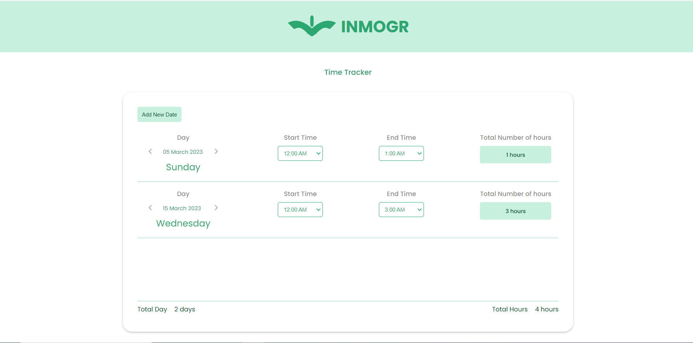

# Time Tracker App

This is a time tracker app which keep track of your focus time.  
you can add a date and set a start time and end time. you will see the difference between these time.  
you can also see how many days and how many hours you have foucs.

## Live Preview

## Technologies

- React JS - [Link](https://reactjs.org/)
- Firebase - [Link](https://firebase.google.com/)
- Vite-plugin-svgr - [Link](https://www.npmjs.com/package/vite-plugin-svgr)
- React-datepicker - [Link](https://www.npmjs.com/package/react-datepicker)
- Styled Componets - [Link](https://styled-components.com/)

## Features

- user can add date
- user can update date
- user can update start time and endtime
- user can see the difference between start time and end time
- user can see the total days and hours

## What I learned

- I learned React JS components
- I learned how to create componets from svg
- I learned Firebase Firestore database
- I learned Typescript

## Author

- Sajib Hossain - [twitter](https://twitter.com/sajib_hsn)
- Sajib Hossain - [Linked in](https://www.linkedin.com/in/sajib-hossain-17929b225/)
